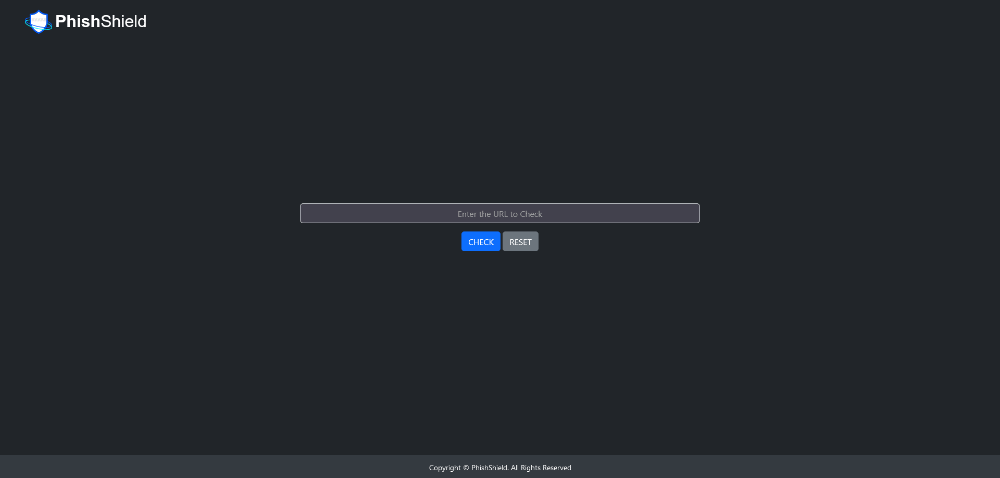
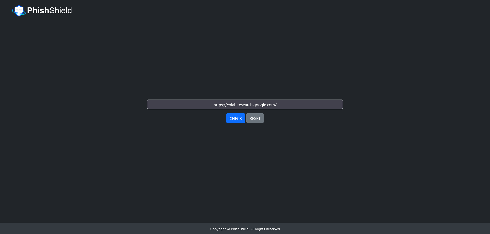
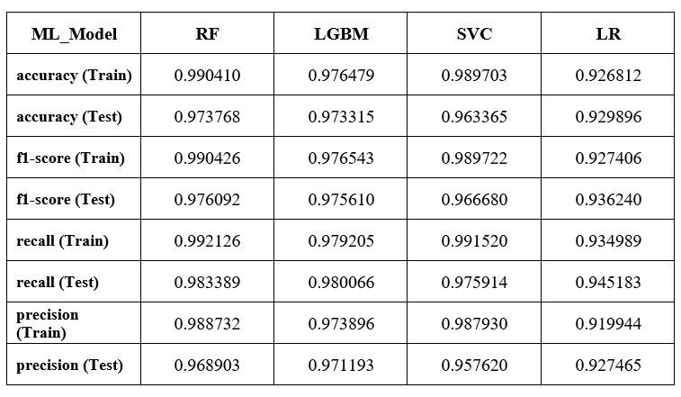
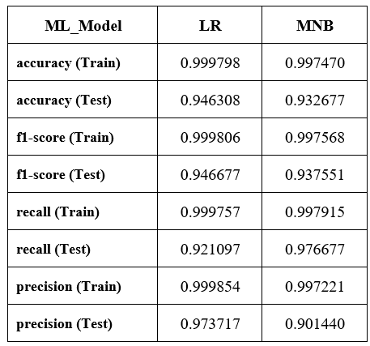

# PhishShield

## Table of Contents

- [Datasets](#dataset)
- [Machine Learning Models](#machine-learning-models)
- [Flask Deployment with Caching](#flask-deployment-with-caching)
- [Webpage Interface](#webpage-interface)
- [Usage](#usage)
- [Results](#results)
- [Contributing](#contributing)
- [License](#license)

## Datasets

The project utilizes two separate datasets, each tailored for training a specific machine learning model.

### Dataset for Feature-based Model

- [The dataset used to train the feature-based model](https://www.kaggle.com/datasets/eswarchandt/phishing-website-detector)

### Dataset for Text-based Model

- [The dataset used to train the text-based model](https://www.kaggle.com/datasets/harisudhan411/phishing-and-legitimate-urls)

## Machine Learning Models

The repository includes two machine learning models:

### Feature-based Model:

This model is built using Python and popular libraries such as scikit-learn. It employs a supervised learning approach, where the model learns from labeled examples to make predictions based on the 29 URL features.

### Text-based Model:

This model also uses Python and machine learning libraries to analyze the text content of URLs. It extracts relevant features from the text and trains a separate classifier to detect phishing websites.

The training process involves utilizing scikit-learn pipelines, which consist of custom transformers for preprocessing data before feeding it to the models. Grid search with cross-validation is used to tune hyperparameters and optimize model performance.

Each model is evaluated using metrics such as accuracy, precision, recall, and F1-score to assess its effectiveness in distinguishing between phishing and legitimate websites.

## Flask Deployment with Caching

Both machine learning models are deployed using Flask, a lightweight web framework for Python. The Flask app exposes endpoints to make predictions using the trained models. Additionally, caching to disk is implemented to improve performance by storing results of previous predictions.

## Webpage Interface

The web interface is built using HTML, CSS, and Bootstrap to provide a user-friendly experience. Users can input a URL and receive predictions on whether it is a phishing website or not.
<div align="center">
    
    
</div>

## Usage

To use the PhishShield, follow these steps:

1. Clone the repository:

   ```
   git clone --depth=1 https://github.com/praneeth-katuri/PhishShield.git
   ```

2. Install the required dependencies:

   ```
   pip install -r requirements.txt
   ```

3. To start the Flask application, run the following command in your terminal:

   ```
   python app.py
   ```

4. To access the webpage interface, open `http://127.0.0.1:5000` in your web browser.

## Results

The performance of the phishing detection models is evaluated using metrics such as accuracy, precision, recall, and F1-score. The results demonstrate the effectiveness of each model in distinguishing between phishing and legitimate websites.

### Feature-based Model

<div align="center">
    
</div>

### Text-based Model

<div align="center">
    
</div>

## Contributing

Contributions to this project are welcome! If you have ideas for improvements or new features, feel free to open an issue or submit a pull request.

## License

This project is licensed under the MIT License - see the [LICENSE](LICENSE) file for details.
